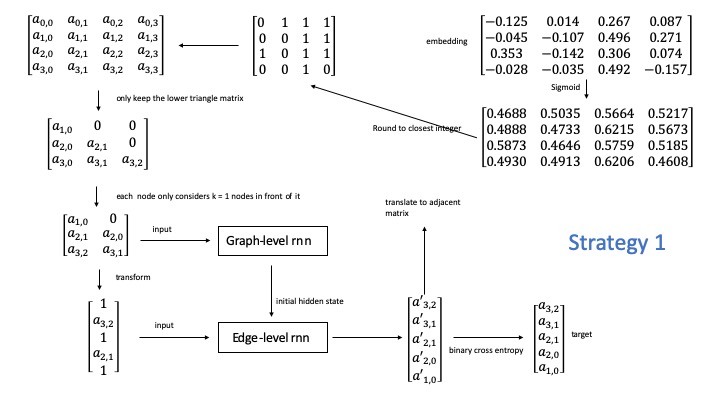
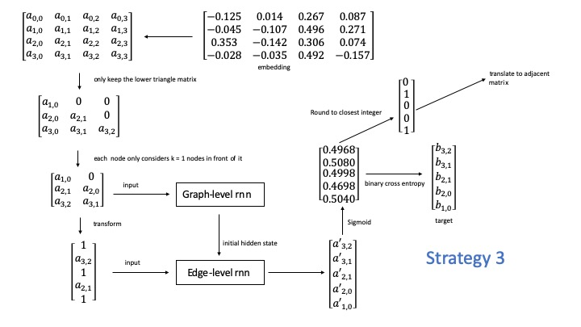

Last week we have discussed the 3 strategies for integrating node embedding with Graph-RNN. We think the Strategy 3 is the most reasonable strategy. This week I have implemented the strategy 3 and got some experment results.

|Method     | Original GraphRNN | Strategy 1 for integrating node embedding with Graph-RNN |Strategy 3 for integrating node embedding with Graph-RNN|
| :---        |    :----:   |    :----:   |          ---: |
|Degree     | 0.1631650749      | 1.852754479   |1.22303648|
|Clustering coef.   | 0.03183506654       |1.981700998      |1.996543150|
|Orbit counts   | 0.06887923342        |1.323235293      |0.871948051|

The results show that Strategy 3 could get better result than strategy 1. But it still can not get similar quality as the original GraphRNN. So I think next step we have two possible directions to explore: 1. Explore integrating with other embedding methods; 2. Focus on merging generated small scale graphs into a large one

### Training loss for strategy 3 (100 epochs)

Epoch: 1/100, train loss: 0.636105, graph type: grid, num_layer: 4, hidden: 128				
Epoch: 2/100, train loss: 0.178218, graph type: grid, num_layer: 4, hidden: 128				
Epoch: 3/100, train loss: 0.137293, graph type: grid, num_layer: 4, hidden: 128				
Epoch: 4/100, train loss: 0.127091, graph type: grid, num_layer: 4, hidden: 128				
Epoch: 5/100, train loss: 0.120925, graph type: grid, num_layer: 4, hidden: 128				
Epoch: 6/100, train loss: 0.115620, graph type: grid, num_layer: 4, hidden: 128				
Epoch: 7/100, train loss: 0.104961, graph type: grid, num_layer: 4, hidden: 128				
Epoch: 8/100, train loss: 0.098266, graph type: grid, num_layer: 4, hidden: 128				
Epoch: 9/100, train loss: 0.096523, graph type: grid, num_layer: 4, hidden: 128				
Epoch: 10/100, train loss: 0.092646, graph type: grid, num_layer: 4, hidden: 128				
Epoch: 11/100, train loss: 0.097138, graph type: grid, num_layer: 4, hidden: 128				
Epoch: 12/100, train loss: 0.091115, graph type: grid, num_layer: 4, hidden: 128				
Epoch: 13/100, train loss: 0.090411, graph type: grid, num_layer: 4, hidden: 128				
Epoch: 14/100, train loss: 0.090012, graph type: grid, num_layer: 4, hidden: 128				
Epoch: 15/100, train loss: 0.092012, graph type: grid, num_layer: 4, hidden: 128				
Epoch: 16/100, train loss: 0.089621, graph type: grid, num_layer: 4, hidden: 128				
Epoch: 17/100, train loss: 0.089169, graph type: grid, num_layer: 4, hidden: 128				
Epoch: 18/100, train loss: 0.090107, graph type: grid, num_layer: 4, hidden: 128				
Epoch: 19/100, train loss: 0.093926, graph type: grid, num_layer: 4, hidden: 128				
Epoch: 20/100, train loss: 0.089771, graph type: grid, num_layer: 4, hidden: 128				
Epoch: 21/100, train loss: 0.090715, graph type: grid, num_layer: 4, hidden: 128				
Epoch: 22/100, train loss: 0.089143, graph type: grid, num_layer: 4, hidden: 128				
Epoch: 23/100, train loss: 0.088997, graph type: grid, num_layer: 4, hidden: 128				
Epoch: 24/100, train loss: 0.086262, graph type: grid, num_layer: 4, hidden: 128				
Epoch: 25/100, train loss: 0.084905, graph type: grid, num_layer: 4, hidden: 128				
Epoch: 26/100, train loss: 0.087165, graph type: grid, num_layer: 4, hidden: 128				
Epoch: 27/100, train loss: 0.087037, graph type: grid, num_layer: 4, hidden: 128				
Epoch: 28/100, train loss: 0.087146, graph type: grid, num_layer: 4, hidden: 128				
Epoch: 29/100, train loss: 0.093952, graph type: grid, num_layer: 4, hidden: 128				
Epoch: 30/100, train loss: 0.092997, graph type: grid, num_layer: 4, hidden: 128				
Epoch: 31/100, train loss: 0.087553, graph type: grid, num_layer: 4, hidden: 128				
Epoch: 32/100, train loss: 0.088324, graph type: grid, num_layer: 4, hidden: 128				
Epoch: 33/100, train loss: 0.085696, graph type: grid, num_layer: 4, hidden: 128				
Epoch: 34/100, train loss: 0.086178, graph type: grid, num_layer: 4, hidden: 128				
Epoch: 35/100, train loss: 0.083716, graph type: grid, num_layer: 4, hidden: 128				
Epoch: 36/100, train loss: 0.088414, graph type: grid, num_layer: 4, hidden: 128				
Epoch: 37/100, train loss: 0.086582, graph type: grid, num_layer: 4, hidden: 128				
Epoch: 38/100, train loss: 0.087870, graph type: grid, num_layer: 4, hidden: 128				
Epoch: 39/100, train loss: 0.086517, graph type: grid, num_layer: 4, hidden: 128				
Epoch: 40/100, train loss: 0.085507, graph type: grid, num_layer: 4, hidden: 128				
Epoch: 41/100, train loss: 0.087177, graph type: grid, num_layer: 4, hidden: 128				
Epoch: 42/100, train loss: 0.087502, graph type: grid, num_layer: 4, hidden: 128				
Epoch: 43/100, train loss: 0.087651, graph type: grid, num_layer: 4, hidden: 128				
Epoch: 44/100, train loss: 0.089031, graph type: grid, num_layer: 4, hidden: 128				
Epoch: 45/100, train loss: 0.090053, graph type: grid, num_layer: 4, hidden: 128				
Epoch: 46/100, train loss: 0.087277, graph type: grid, num_layer: 4, hidden: 128				
Epoch: 47/100, train loss: 0.092137, graph type: grid, num_layer: 4, hidden: 128				
Epoch: 48/100, train loss: 0.086861, graph type: grid, num_layer: 4, hidden: 128				
Epoch: 49/100, train loss: 0.088795, graph type: grid, num_layer: 4, hidden: 128				
Epoch: 50/100, train loss: 0.088899, graph type: grid, num_layer: 4, hidden: 128				
Epoch: 51/100, train loss: 0.088308, graph type: grid, num_layer: 4, hidden: 128				
Epoch: 52/100, train loss: 0.083329, graph type: grid, num_layer: 4, hidden: 128				
Epoch: 53/100, train loss: 0.086275, graph type: grid, num_layer: 4, hidden: 128				
Epoch: 54/100, train loss: 0.092597, graph type: grid, num_layer: 4, hidden: 128				
Epoch: 55/100, train loss: 0.087992, graph type: grid, num_layer: 4, hidden: 128				
Epoch: 56/100, train loss: 0.088452, graph type: grid, num_layer: 4, hidden: 128				
Epoch: 57/100, train loss: 0.088737, graph type: grid, num_layer: 4, hidden: 128				
Epoch: 58/100, train loss: 0.088254, graph type: grid, num_layer: 4, hidden: 128				
Epoch: 59/100, train loss: 0.084826, graph type: grid, num_layer: 4, hidden: 128				
Epoch: 60/100, train loss: 0.091742, graph type: grid, num_layer: 4, hidden: 128				
Epoch: 61/100, train loss: 0.085959, graph type: grid, num_layer: 4, hidden: 128				
Epoch: 62/100, train loss: 0.085028, graph type: grid, num_layer: 4, hidden: 128				
Epoch: 63/100, train loss: 0.084720, graph type: grid, num_layer: 4, hidden: 128				
Epoch: 64/100, train loss: 0.089239, graph type: grid, num_layer: 4, hidden: 128				
Epoch: 65/100, train loss: 0.089815, graph type: grid, num_layer: 4, hidden: 128				
Epoch: 66/100, train loss: 0.084890, graph type: grid, num_layer: 4, hidden: 128				
Epoch: 67/100, train loss: 0.088628, graph type: grid, num_layer: 4, hidden: 128				
Epoch: 68/100, train loss: 0.083858, graph type: grid, num_layer: 4, hidden: 128				
Epoch: 69/100, train loss: 0.084572, graph type: grid, num_layer: 4, hidden: 128				
Epoch: 70/100, train loss: 0.088456, graph type: grid, num_layer: 4, hidden: 128				
Epoch: 71/100, train loss: 0.084942, graph type: grid, num_layer: 4, hidden: 128				
Epoch: 72/100, train loss: 0.086457, graph type: grid, num_layer: 4, hidden: 128				
Epoch: 73/100, train loss: 0.088220, graph type: grid, num_layer: 4, hidden: 128				
Epoch: 74/100, train loss: 0.088372, graph type: grid, num_layer: 4, hidden: 128				
Epoch: 75/100, train loss: 0.084056, graph type: grid, num_layer: 4, hidden: 128				
Epoch: 76/100, train loss: 0.089017, graph type: grid, num_layer: 4, hidden: 128				
Epoch: 77/100, train loss: 0.085021, graph type: grid, num_layer: 4, hidden: 128				
Epoch: 78/100, train loss: 0.085295, graph type: grid, num_layer: 4, hidden: 128				
Epoch: 79/100, train loss: 0.090458, graph type: grid, num_layer: 4, hidden: 128				
Epoch: 80/100, train loss: 0.088671, graph type: grid, num_layer: 4, hidden: 128				
Epoch: 81/100, train loss: 0.092186, graph type: grid, num_layer: 4, hidden: 128				
Epoch: 82/100, train loss: 0.086162, graph type: grid, num_layer: 4, hidden: 128				
Epoch: 83/100, train loss: 0.087741, graph type: grid, num_layer: 4, hidden: 128				
Epoch: 84/100, train loss: 0.087830, graph type: grid, num_layer: 4, hidden: 128				
Epoch: 85/100, train loss: 0.086567, graph type: grid, num_layer: 4, hidden: 128				
Epoch: 86/100, train loss: 0.084731, graph type: grid, num_layer: 4, hidden: 128				
Epoch: 87/100, train loss: 0.089282, graph type: grid, num_layer: 4, hidden: 128				
Epoch: 88/100, train loss: 0.090449, graph type: grid, num_layer: 4, hidden: 128				
Epoch: 89/100, train loss: 0.091278, graph type: grid, num_layer: 4, hidden: 128				
Epoch: 90/100, train loss: 0.086775, graph type: grid, num_layer: 4, hidden: 128				
Epoch: 91/100, train loss: 0.085402, graph type: grid, num_layer: 4, hidden: 128				
Epoch: 92/100, train loss: 0.085825, graph type: grid, num_layer: 4, hidden: 128				
Epoch: 93/100, train loss: 0.091050, graph type: grid, num_layer: 4, hidden: 128				
Epoch: 94/100, train loss: 0.082746, graph type: grid, num_layer: 4, hidden: 128				
Epoch: 95/100, train loss: 0.086112, graph type: grid, num_layer: 4, hidden: 128				
Epoch: 96/100, train loss: 0.090455, graph type: grid, num_layer: 4, hidden: 128				
Epoch: 97/100, train loss: 0.085771, graph type: grid, num_layer: 4, hidden: 128				
Epoch: 98/100, train loss: 0.087059, graph type: grid, num_layer: 4, hidden: 128				
Epoch: 99/100, train loss: 0.086400, graph type: grid, num_layer: 4, hidden: 128				
Epoch: 100/100, train loss: 0.083972, graph type: grid, num_layer: 4, hidden: 128				
