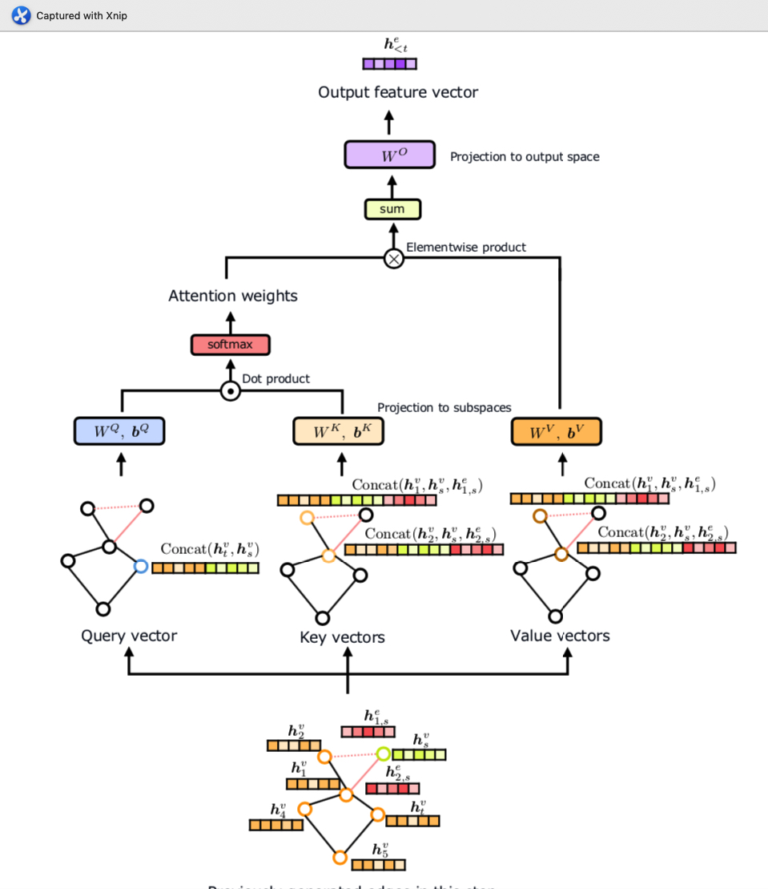

I have read the paper Dr.Lim mentioned last week ["SCALABLE GENERATIVE MODELS FOR GRAPHS WITH
GRAPH ATTENTION MECHANISM"](https://arxiv.org/abs/1906.01861). This paper is very similar to what we want to do. It's also based on GraphRNN. 


The key idea is that it introduces graph attention mechanism and the attention mechanism is brought from google’s transformer model on NLP. The transformer model has achieved the state-of-art performance in machine translation which beats RNN-based models.

The author followed that idea and replace GRU in GraphRNN with graph attention mechanism which is mostly composed of attention layer and feedforward layer. The feature extracter is to get the embedding of nodes and the graph which kind of equals to the graph-level RNN in graphRNN, while the edge estimator equals to the edge-level RNN in graphRNN.
The detailed structure of these two components are at the end of the report.

According to the experiments, it achieves comparable reults as GraphRNN. Since some steps of the attention mechanism are parallal, it gets speedups compared with GraphRNN.  

Also, it introduces a stricter upper bound of the number of previous nodes needed to be considered by current node in BFS order. It could reduce the model size. But the authors do not report the memory costs of their model.

Although, they claims this is a scalable model but in their experiments, they still use small-scale graphs (less than 1000 nodes). The authors have not shown evidence that their model can support much larger scale graph generation.

This is a good extension of graphRNN and pointed out an interesting direction of improving GraphRNN.

Next step I would like to explore the literatures about partitioning large graphs into small graphs and merging small scaled graphs into a large one while maintaining similar properties.





```python

```
